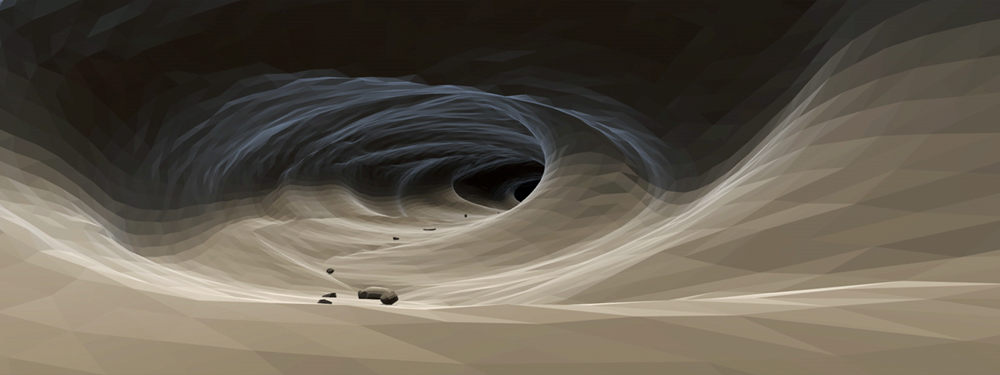

## Unity Procedural Cave Generator - [Demo Video](https://youtu.be/FvgW51XR528) 

A simple 3D cave generator with a couple of config options and animated properties.

TODO...

* Real curvature. Cave chunks can shift in x/y direction, but are always added at fixed intervals along the z-axis.
* More efficient mesh generation. Each triangle has its dedicated vertices. The number of vertices should be reduced for smooth areas.
* Branching tunnels!